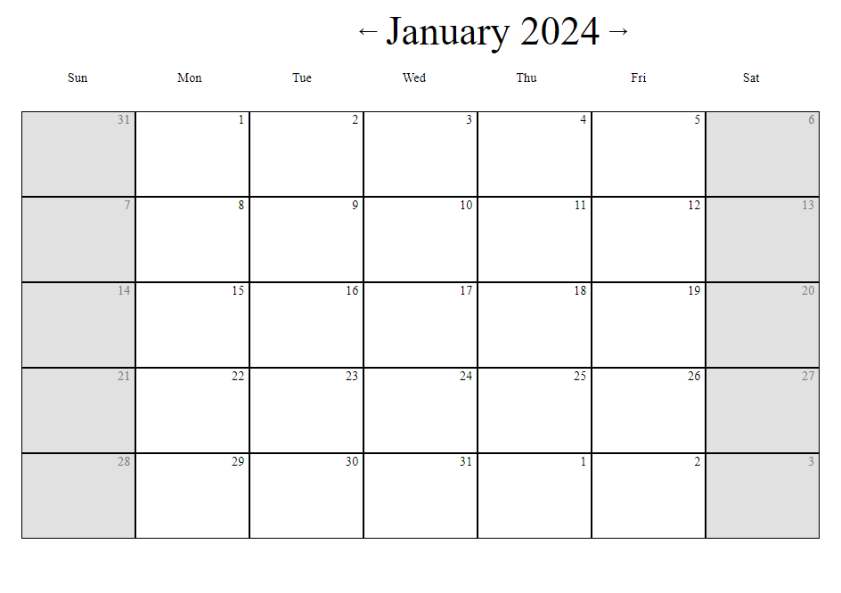
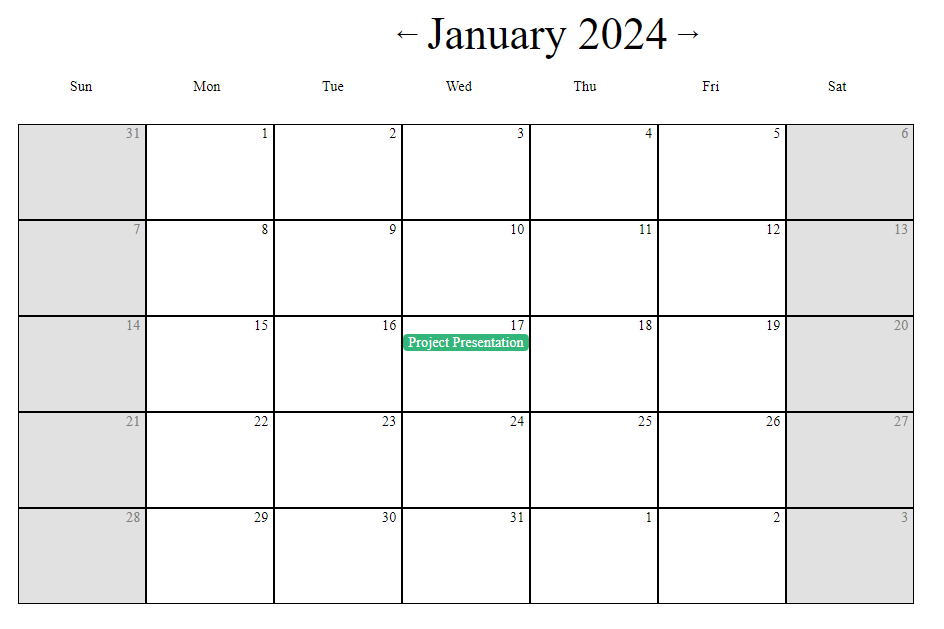
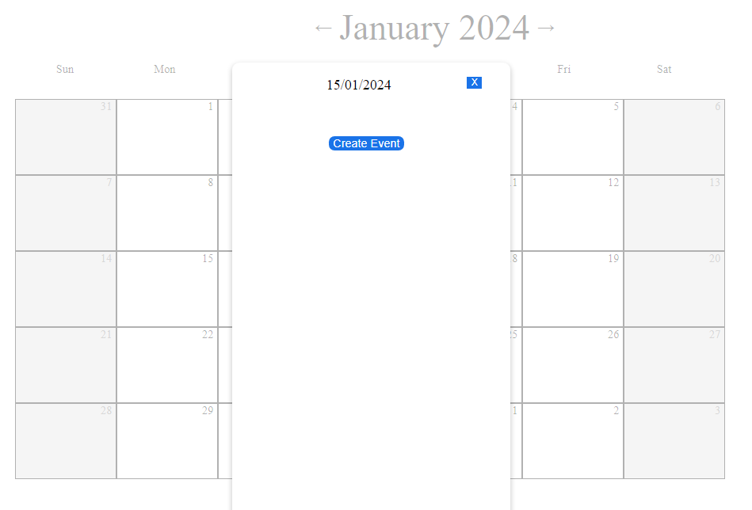
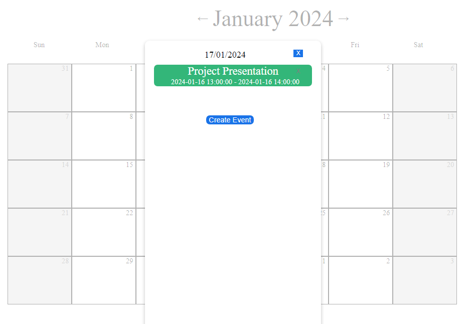
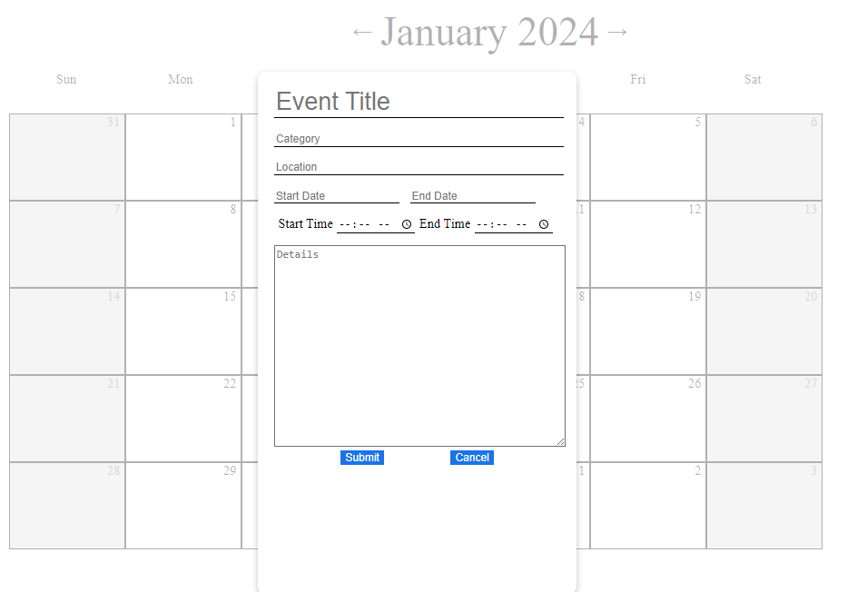

# Title {Replace with the project title}

{add test badges here, all projects you build from here on out will have tests, therefore you should have github workflow badges at the top of your repositories: [Github Workflow Badges](https://docs.github.com/en/actions/monitoring-and-troubleshooting-workflows/adding-a-workflow-status-badge)}

## Demo & Snippets

### Home Page:




### Selected Day:




### Event Form:

## 

---

## Requirements / Purpose

### MVP:

- Create a page that displays a calendar. The calendar should include a title showing the current month and a grid of days (Please note that you DO NOT have to use css grid to style it).

- Each of the days cells should be clickable.
- When a user click on a chosen day, a modal should appear
  The user should be able to navigate between months - view the upcoming month, previous month etc.
- The user should be able to do the following:

  - Create a new event
  - Update an existing future event
  - Delete an event
  - Retrieve all events from the database
  - Retrieve a single event from the database
  - All data coming from the user should be validated.

---

## Build Steps

1. Clone project first:

```bash
git clone git@github.com:AnthonySchramko/Events-Creator.git
```

### Backend

Import backend into a Java IDE, such as Eclipse, and run the App.java

### Frontend

Path to directory

```bash
cd Events-Creator/events-creator
```

Install dependencies

```bash
npm install
```

Start the server

```bash
npm run dev
```

### Database

Create a database in MySQL and call it 'events_calendar'

---

## Design Goals / Approach

- This website was made with the aim to allow users to plan out their days with a simple event calendar. The user can select a day, and create an event that with a start and end date/time along with any details required.
- It was made with a simplistic design, similar to Google Calendar month view. This is relatively simplistic yet aesthetic, showing all the days in a square (including days from other months).

---

## Features

- The user can click through each month, and select specific days. Events show up under the day if created.
- If a day is selected, the user can either edit or remove existing events or create a new event.

---

## Known issues

- Due to time/date conversions, occasionally event can show up on wrong day.
- End date sometimes doesn't update when event made.

---

## Future Goals

- Add labels which generate different coloured events and a filter for the labels

---
